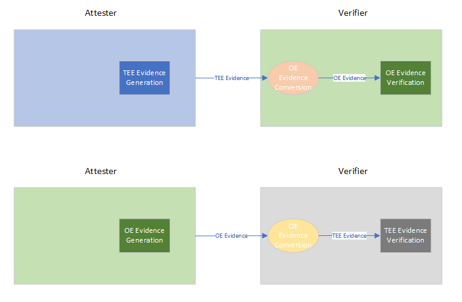

Attestation Evidence Format Support
=====

One of the goal of OE SDK attestation design is to be TEE-agnostic. At the same time, OE SDK should enable the scenario to for a verifier application to verify evidences from different sources and TEEs, if the format is known to the verifier.

Motivation
----------

As reported in issue 2999, attestation service has to verify evidence generated by legacy OE SDK API `oe_get_report()` and raw TEE evidence generation such as SGX quote generation mechanism.

Goals:
- Verifier can call OE SDK API to verify known evidence formats generated by either OE SDK API or other attesters.
- Evidence format generated by OE SDK API is TEE-agnostic.

User Experience
---------------

Helper API will be provided to 
- Convert raw TEE evidence to OE evidence
- Convert OE evidence to raw TEE evidence

Specification
-------------

## OE Evidence 

## Abstract New APIs

### Convert from raw evidence to oe evidence call
This API is used by an app to convert a TEE-specific evidence to OE evidence.
#### Inputs:
- Evidence format ID
- Raw evidence buffer
- Raw evidence buffer size
#### Outputs:
- OE evidence buffer
- OE evidence buffer size

### Convert from oe evidence to raw evidence call
This API is used by an app to convert an OE evidence to TEE-specific evidence 
#### Inputs:
- OE evidence buffer
- OE evidence buffer size
#### Outputs:
- Evidence format ID
- Raw evidence buffer
- Raw evidence buffer size

Alternates
----------

## Optoins 1
OE verification API to take evidence format ID as an input:

    oe_verify_evidence(
        evidence_format_id,
        raw_evidence_buffer,
        raw_evidence_buffer_size,
        ...);

### This option decouples evidence format ID and raw evidence buffer. There is no extra space for OE-defined evidence fields such as custom claims.

## Optoins 2
OE verification API to guess the format of the evidence:

    oe_verify_evidence(
        evidence_buffer,
        evidence_buffer_size,
        ...);

### Evidence format guessing can be challenging. If the verifier already knows the format, guesssing is less reliable. Other TEE verifier cannot verify OE evidence.

Authors
-------

Yen Lee (yenlee@microsoft.com)
